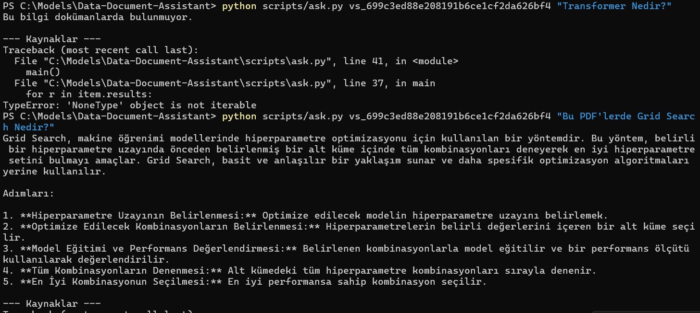

# Data Document Assistant

A Retrieval-Augmented Generation (RAG) system that indexes PDF documents using OpenAI Vector Stores and answers questions strictly based on the provided documents.

The system uses:

- OpenAI GPT-4o  
- File Search tool  
- Vector Store indexing  
- Guardrails to prevent hallucination  

---

## 🚀 Features

- Upload and index PDF documents  
- Semantic search over documents  
- Answers restricted to document content only  
- Source reporting  
- Safe fallback if information is not found  

---

## 📁 Project Structure

```
data-document-assistant/
│
├── documents/              # PDF files
├── scripts/
│   ├── index_docs.py       # Upload & index PDFs
│   ├── ask.py              # Ask questions
│   └── check_status.py     # Check indexing status
├── assets/                 # Screenshots
│   └── image.png
├── .env                    # API key (not committed)
├── .gitignore
└── README.md
```

---

## ⚙️ Installation

Create a virtual environment:

```bash
python -m venv .venv
```

Activate it (Windows PowerShell):

```bash
.\.venv\Scripts\Activate.ps1
```

Install dependencies:

```bash
pip install -U openai python-dotenv
```

---

## 🔐 Environment Variable

Create a `.env` file in the project root:

```
OPENAI_API_KEY=your_api_key_here
```

---

## 📄 Index Documents

Place your PDF files inside the `documents/` folder.

Then run:

```bash
python scripts/index_docs.py
```

The script will output a `vs_...` vector store ID.

---

## ❓ Ask Questions

Use the generated vector store ID:

```bash
python scripts/ask.py vs_XXXXXXXX "What are the differences between CNN and RNN?"
```

The assistant will:

- Search only within indexed documents  
- Refuse to answer if the information is not found  
- Optionally display document sources  

---

## 🧠 Guardrail Behavior

If the answer is not found inside the provided documents, the assistant returns:

```
This information is not available in the provided documents.
```

---

## 🖥 Example Output

<p align="center">
  
</p>

The example demonstrates:

- A successful document-based answer  
- A safe fallback response when the answer is not found  
- Source extraction behavior  

---

## 🛠 Tech Stack

- Python  
- OpenAI GPT-4o  
- OpenAI Vector Store  
- File Search Tool  

---

## 📌 Author

Built as a practical RAG implementation using OpenAI’s `file_search` and vector store architecture.
